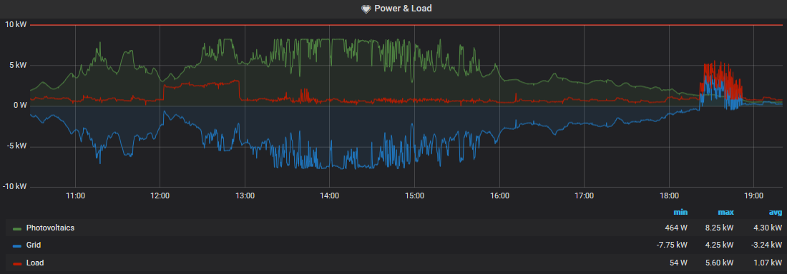

ifndef::env-github[:icons: font]
ifdef::env-github[]
:status:
:tip-caption: :bulb:
:note-caption: :information_source:
:important-caption: :heavy_exclamation_mark:
:caution-caption: :fire:
:warning-caption: :warning:
:ext-relative: {outfilesuffix}
endif::[]

= Fronius Exporter

ifdef::status[]
image:https://img.shields.io/github/workflow/status/ccremer/fronius-exporter/Build/master[Build,link=https://github.com/ccremer/fronius-exporter/actions?query=workflow%3ABuild]
image:https://img.shields.io/codeclimate/maintainability/ccremer/fronius-exporter[Maintainability,link=https://codeclimate.com/github/ccremer/fronius-exporter]
image:https://img.shields.io/codeclimate/coverage/ccremer/fronius-exporter[Tests,link=https://codeclimate.com/github/ccremer/fronius-exporter]
image:https://img.shields.io/github/v/release/ccremer/fronius-exporter[Releases,link=https://github.com/ccremer/fronius-exporter/releases]
image:https://img.shields.io/github/license/ccremer/fronius-exporter[License,link=https://github.com/ccremer/fronius-exporter/blob/master/LICENSE]
endif::[]

== About

Scrapes a Fronius Photovoltaic power installation and converts sensor data to Prometheus metrics.
It has been tested with Fronius Symo 8.2-3-M (Software version 3.14.1-10).

== Installing

=== Binary

. Download latest binary from the https://github.com/ccremer/fronius-exporter/releases[Releases page]
. `chmod +x fronius-exporter && mv fronius-exporter /usr/local/bin/`

=== Package

Comes with systemd unit file.

. Download latest package from the https://github.com/ccremer/fronius-exporter/releases[Releases page]
. `sudo dpkg -i fronius-exporter_linux_amd64.deb` (Debian/Ubuntu)
. `sudo rpm -i fronius-exporter_linux_amd64.rpm` (CentOS)
. `sudo systemctl daemon-reload`
. Edit the settings in `/etc/default/fronius-exporter`
. `sudo systemctl enable fronius-exporter`
. `sudo systemctl restart fronius-exporter`

=== Docker

. `docker run -d --name fronius-exporter -p "8080:8080" ghcr.io/ccremer/fronius-exporter --help`

=== Helm Chart

With https://ccremer.github.io/charts/fronius-exporter[fronius-exporter]

. `helm repo add ccremer https://ccremer.github.io/charts`
. `helm install fronius ccremer/fronius-exporter`

== Usage

[source,console]
----
fronius-exporter --symo.url http://symo.ip.or.hostname
----

Upon each call to `/metrics`, the exporter will do a GET request on the given URL, and translate the JSON response to Prometheus metrics format.

== Configuration

`fronius-exporter` can be configured with CLI flags.
Call the binary with `--help` to get a list of options.

[TIP]
====
All flags are also configurable with Environment variables.

* Replace the `-` char with `_` in the names and uppercase the names
* Replace the `.` delimiter with `__`
* CLI flags take precedence

.Following calls are equivalent
----
fronius-exporter --symo.url http://...
SYMO__URL=http://... fronius-exporter
----
====

== As a client API

See link:examples/client.go[Example]

== Developing

=== Requirements

* Go
* Docker

=== Building

Run `make help` to see available goals

Platform related builds are handled by `goreleaser`:

----
export GOOS=linux
export GOARCH=arm64
export IMAGE_REPOSITORY=ccremer/fronius-exporter
goreleaser build --snapshot --rm-dist --single-target
----

On the other hand you can also use the actual `make build` in combination with `docker buildx`

----
export GOOS=linux
export GOARCH=arm64
export IMAGE_REPOSITORY=ccremer/fronius-exporter

make build
# you now have a binary with arm64 arch

docker buildx build --platform linux/arm64 -t $IMAGE_REPOSITORY --push .
----

=== Test metrics

If you don't have a Symo device at hand, you can fake one:

[source,console]
----
# In its own terminal
python3 -m http.server 8081

# In another terminal
go run . -v --symo.url http://localhost:8081/pkg/fronius/testdata/example_1.json

# Yet another terminal or browser
curl -L http://localhost:8080/metrics
----
