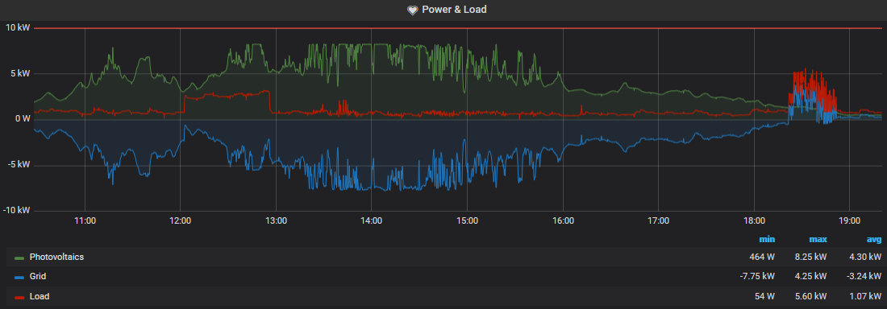

ifndef::env-github[:icons: font]
ifdef::env-github[]
:status:
:tip-caption: :bulb:
:note-caption: :information_source:
:important-caption: :heavy_exclamation_mark:
:caution-caption: :fire:
:warning-caption: :warning:
:ext-relative: {outfilesuffix}
endif::[]

= Fork info
This is a fork of https://github.com/ccremer/fronius-exporter, with added support for MQTT & HomeAssistant integration.

= Fronius Exporter

ifdef::status[]
image:https://img.shields.io/github/v/release/ccremer/fronius-exporter[Releases,link=https://github.com/ccremer/fronius-exporter/releases]
image:https://img.shields.io/github/license/ccremer/fronius-exporter[License,link=https://github.com/ccremer/fronius-exporter/blob/master/LICENSE]
endif::[]

== About

Scrapes a Fronius Photovoltaic power installation and converts sensor data to Prometheus metrics.
It has been tested with Fronius Symo 8.2-3-M (Software version 3.14.1-10).

== Installing

=== Binary

. Download latest binary from the https://github.com/ccremer/fronius-exporter/releases[Releases page]
. `chmod +x fronius-exporter && mv fronius-exporter /usr/local/bin/`

=== Package

Comes with systemd unit file.

. Download latest package from the https://github.com/ccremer/fronius-exporter/releases[Releases page]
. `sudo dpkg -i fronius-exporter_linux_amd64.deb` (Debian/Ubuntu)
. `sudo rpm -i fronius-exporter_linux_amd64.rpm` (CentOS)
. `sudo systemctl daemon-reload`
. Edit the settings in `/etc/default/fronius-exporter`
. `sudo systemctl enable fronius-exporter`
. `sudo systemctl restart fronius-exporter`

=== Docker

. `docker run -d --name fronius-exporter -p "8080:8080" ghcr.io/ccremer/fronius-exporter --help`

=== Helm Chart

With https://ccremer.github.io/charts/fronius-exporter[fronius-exporter]

. `helm repo add ccremer https://ccremer.github.io/charts`
. `helm install fronius ccremer/fronius-exporter`

== Usage

[source,console]
----
fronius-exporter --symo.url http://symo.ip.or.hostname
----

The exporter polls the configured Fronius endpoints in the background every 10 seconds by default and stores the latest results internally. The `/metrics` handler serves Prometheus metrics from that in-memory state.

If the cached data is older than the configured freshness timeout, `/metrics` responds with HTTP 503 instead of serving stale metrics.

If MQTT is configured, each successful background poll update is also queued for asynchronous MQTT publishing to the configured base topic with a suffix per data type:

* `<base-topic>/power-flow`
* `<base-topic>/archive`
* `<base-topic>/inverter-realtime`
* `<base-topic>/meter-realtime`

Each MQTT payload contains the message type, a timestamp, and the full data returned by the corresponding Fronius API endpoint.

MQTT connection setup does not block startup. Connection failures are logged but do not stop the exporter. Automatic reconnect and connect retry are enabled so broker reconnections work without restarting the exporter.

MQTT can also be customized with a fixed client ID, publish queue size, reconnect interval, TLS client/server options, and an availability topic with last-will payloads. By default, the availability topic is `<base-topic>/availability`.

Optionally, the exporter can also publish Home Assistant MQTT discovery sensor definitions as retained messages.

== Configuration

`fronius-exporter` can be configured with CLI flags.
Call the binary with `--help` to get a list of options.

[TIP]
====
All flags are also configurable with Environment variables.

* Replace the `-` char with `_` in the names and uppercase the names
* Replace the `.` delimiter with `__`
* CLI flags take precedence

.Following calls are equivalent
----
fronius-exporter --symo.url http://...
SYMO__URL=http://... fronius-exporter
----
====

=== MQTT

Example:

[source,console]
----
fronius-exporter \
  --symo.url http://symo.ip.or.hostname \
  --mqtt.broker tcp://mqtt-broker:1883 \
  --mqtt.username my-user \
  --mqtt.password my-password \
  --mqtt.base-topic home/solar/fronius \
  --mqtt.client-id fronius-exporter \
  --mqtt.queue-size 32 \
  --mqtt.reconnect-interval 5 \
  --mqtt.availability-topic home/solar/fronius/status
----

This publishes JSON messages to topics such as `home/solar/fronius/power-flow` and `home/solar/fronius/meter-realtime` whenever the background poll succeeds.

==== Home Assistant MQTT discovery

Example:

[source,console]
----
fronius-exporter \
  --symo.url http://symo.ip.or.hostname \
  --mqtt.broker tcp://mqtt-broker:1883 \
  --mqtt.base-topic home/solar/fronius \
  --mqtt.discovery-enabled \
  --mqtt.discovery-prefix homeassistant \
  --mqtt.discovery-device-name "Garage Solar" \
  --mqtt.discovery-device-id garage-solar
----

When enabled, the exporter publishes retained Home Assistant sensor discovery config topics under `<discovery-prefix>/sensor/<device-id>/.../config`.

Discovery entities are only published for Fronius endpoint groups that are enabled in the exporter configuration. For example, archive sensors are omitted entirely when `symo.enable-archive` is disabled.

If `mqtt.availability-topic` is configured, discovered sensors also include Home Assistant availability metadata and the exporter publishes `mqtt.availability-payload-up` on connect and `mqtt.availability-payload-down` as the broker last-will payload.

All MPPT discovery entities are published. Only the first MPPT point is enabled by default in Home Assistant; additional MPPT points are marked `enabled_by_default: false`.

The site power sensors for grid, load, battery, and PV are also published via discovery, but are marked `enabled_by_default: false`.

Site autonomy and battery-related sensors such as inverter battery SoC are also marked `enabled_by_default: false`.

You can use either:

* automatic MQTT discovery in Home Assistant, or
* the static example file at link:examples/homeassistant-mqtt.yaml[examples/homeassistant-mqtt.yaml]

== As a client API

See link:examples/client.go[Example]

== Developing

=== Requirements

* Go
* Docker

=== Building

Run `make help` to see available goals

Platform related builds are handled by `goreleaser`:

----
export GOOS=linux
export GOARCH=arm64
export IMAGE_REPOSITORY=ccremer/fronius-exporter
goreleaser build --snapshot --clean --single-target
----

On the other hand you can also use the actual `make build` in combination with `docker buildx`

----
export GOOS=linux
export GOARCH=arm64
export IMAGE_REPOSITORY=ccremer/fronius-exporter

make build
# you now have a binary with arm64 arch

docker buildx build --platform linux/arm64 -t $IMAGE_REPOSITORY --push .
----

=== Test metrics

If you don't have a Symo device at hand, you can fake one:

[source,console]
----
# In its own terminal
python3 -m http.server 8081

# In another terminal
go run . -v --symo.url http://localhost:8081/pkg/fronius/testdata/example_1.json

# Yet another terminal or browser
curl -L http://localhost:8080/metrics
----
